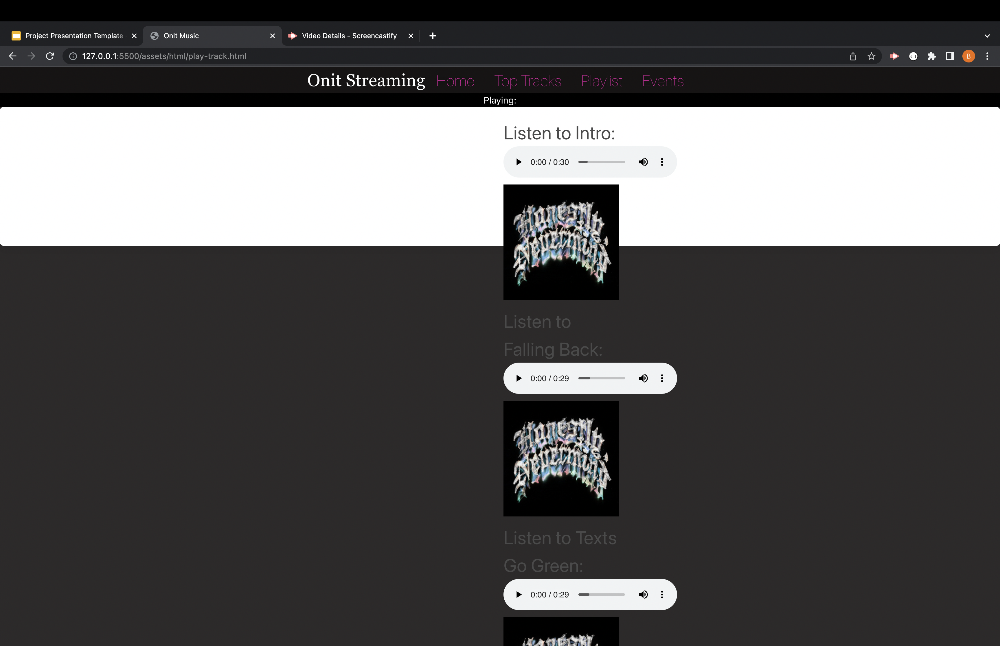
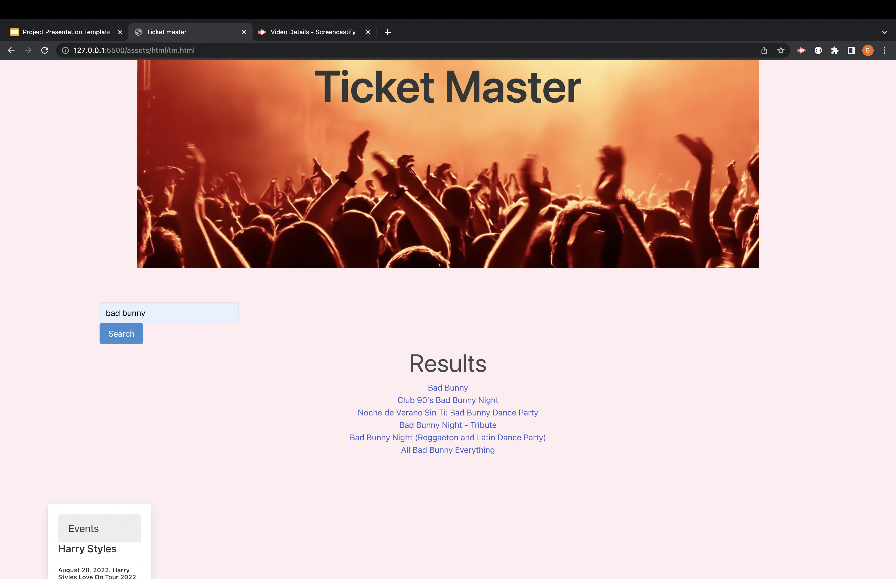

# Onit

## Title

Onit

## Project Description

* As a group our user story is that we created a music media streaming platform. That allows its user to search for an artist and its music associated to them. User is then given a 30 second preview of the song. User also has the availability of serach songs by genres. In the vent the user would like to purchase tickets to attend a concert venue of an artist then they are redirected to tickmaster to purchase tickts.

* As a group we used Bulma for our CSS frame work. our web APIs are Napster and Ticketmaster. In our code we have HTML, JS, and CSS. 

## URL link for live website

https://brenbrenda55.github.io/onit/

## Screenshot of final product

